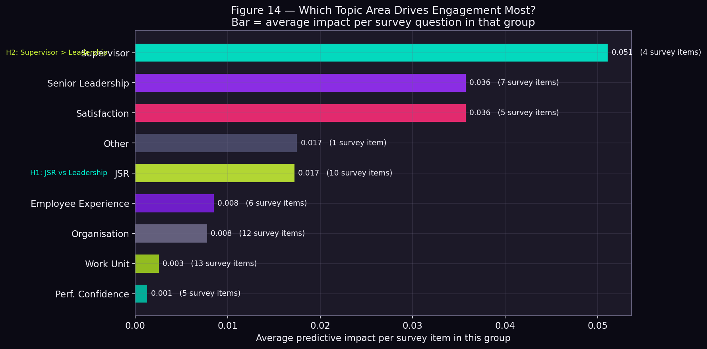
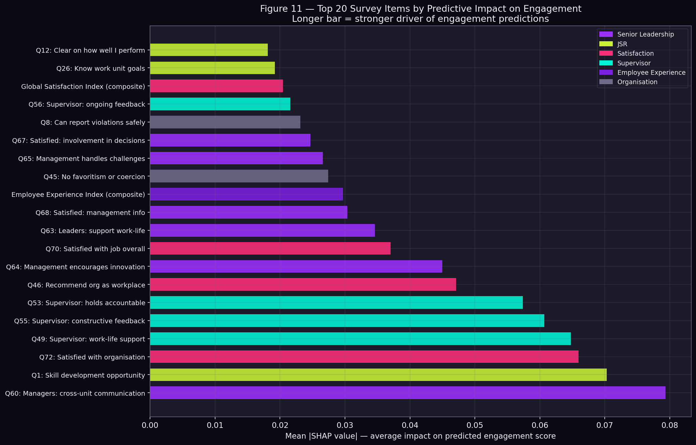
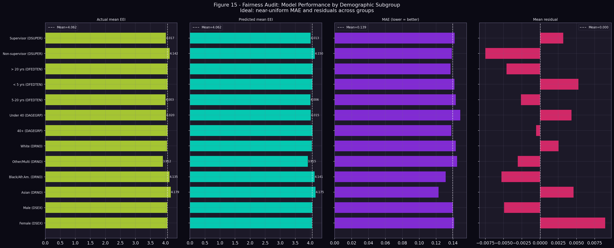
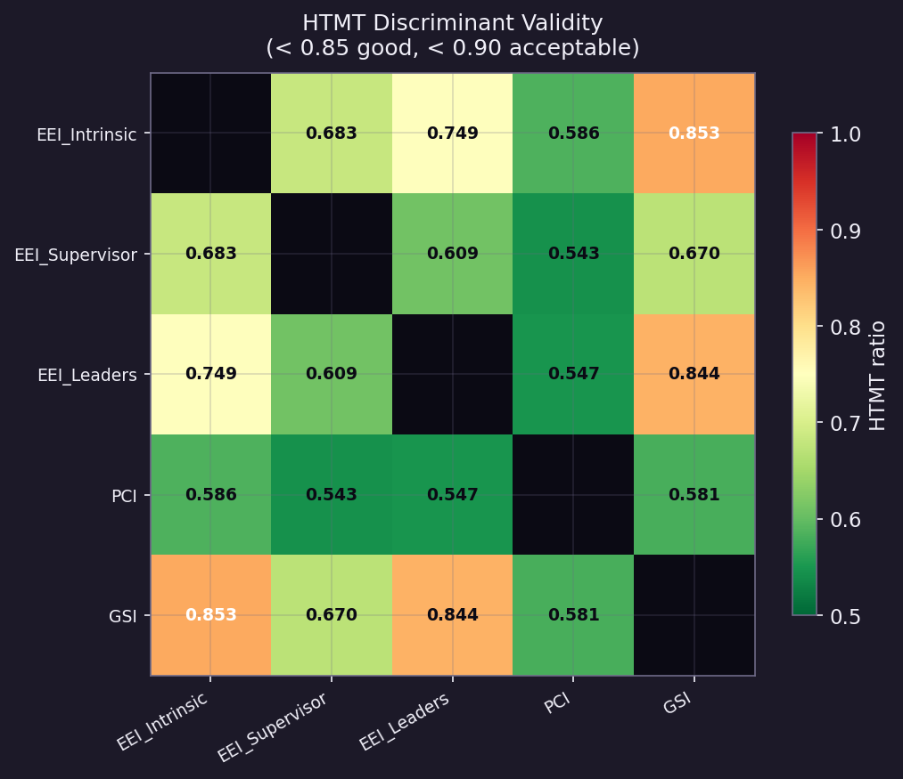
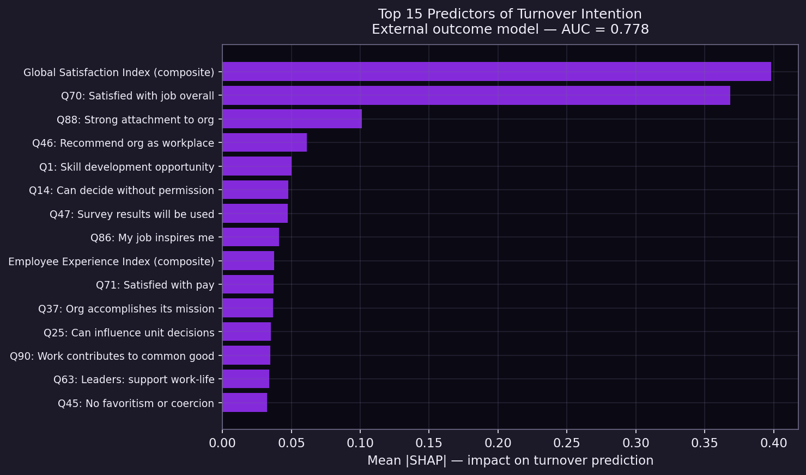

# What Drives Employee Engagement in the US Federal Workforce?
### An end-to-end people analytics project — Federal Employee Viewpoint Survey 2024

---

## Three findings any HR leader can act on

> **1. Your employees' immediate manager matters more than senior leadership.**
> Supervisor behaviours — giving useful feedback, supporting work-life balance — are stronger predictors of engagement than agency-wide leadership culture. Investing in frontline manager quality has a higher return than top-down culture programmes.

> **2. Skill development is the single strongest job-design lever.**
> *"I am given a real opportunity to improve my skills"* is the #2 engagement predictor globally. Employees who feel their growth is supported are substantially more engaged — a direct argument for L&D investment at every level.

> **3. Breaking down silos beats town halls.**
> The top predictor of engagement is whether managers actively promote communication *across* work units. Engagement is not just about what happens in your team — it reflects how connected people feel to the broader organisation.

---

## What makes this analysis different

Most employee survey analyses compute an index score, rank agencies, and stop there. This project applies the methods a psychometrician would use before trusting any model output: it **verifies the measurement structure first**, then models, then interprets — and it explicitly flags what the data cannot tell us.

Using 674,207 respondents from the 2024 FEVS public release, the analysis:
- Confirmed that OPM's published factor structure for the Employee Engagement Index holds up under formal confirmatory factor analysis (CFI = 0.958)
- Quantified how much engagement variance sits between agencies vs within individuals — answer: mostly within (ICC = 0.016), which strengthens individual-level conclusions
- Built a gradient-boosted model explaining 93.9% of individual engagement variance from non-EEI survey items alone
- Used SHAP to identify which specific survey items drive predictions — and verified those findings hold fairly across demographic subgroups
- Validated the top predictors against an independent outcome: employees' stated intention to leave (AUC = 0.778), confirming the drivers are not just survey artefacts

---

## Key chart — what drives engagement

*Each bar shows the average predictive impact of features in that domain. Supervisor behaviours (Q49, Q55) have the highest per-feature impact. JSR items (job design, autonomy, skill development) are competitive at the individual-item level despite averaging lower across the domain. Senior leadership items have meaningful but lower impact than proximate management.*

*Top 20 individual survey items by mean absolute SHAP value. Colours indicate domain. The top feature (Q60 — cross-unit communication) and the #2 feature (Q1 — skill development opportunity) are the most actionable levers for HR teams.*

---

## Engagement and intent to leave

*Employees who plan to leave within one year score substantially lower on engagement than those with no plans to leave. This validates EEI as a meaningful people analytics target — it correlates with the outcome HR teams care most about.*

---

## Fairness — does the model work equally for everyone?

*The model's prediction error (MAE) is nearly identical across sex, age, tenure, and supervisory status groups. The largest disparity is by race (MAE range = 0.022 on a 1–5 scale) — within acceptable bounds. The more important equity finding is in the data itself: employees in the Other/Multi racial category score 0.27 points lower on engagement than Asian employees — a working-conditions gap the model reflects but does not create.*

---

## Additional analyses

Three extensions were added to address common methodological critiques of survey-based people analytics:

**HTMT discriminant validity** — confirmed that all five measured constructs (EEI Intrinsic, EEI Supervisor, EEI Leaders, PCI, GSI) are empirically distinct. All pairwise HTMT ratios are below 0.85 (Good), with one pair reaching 0.853 (Acceptable). Constructs are not redundant.

**Bifactor CFA** — tested whether the EEI SRMR misfit (0.165) reflects a general engagement factor underlying all 15 items. The semopy library could not fully converge the orthogonality constraints required; this is documented as a technical limitation. The misfit is acknowledged and consistent with a hierarchical interpretation of engagement.

**External outcome model — turnover intention** — the same survey items that predict engagement were used to predict DLEAVING (intent to leave within one year), a genuinely independent outcome. AUC = 0.778 across 5-fold cross-validation. This demonstrates that the identified drivers reflect real workforce dynamics, not just shared-method coherence within the survey instrument.

*Top 15 predictors of turnover intention. The overlap with the engagement model's top features (supervisor support, skill development, cross-unit communication) provides external validation of the Step 5 SHAP findings.*

---

## Limitations

- **Cross-sectional data.** All findings are associations, not causal effects. Higher supervisor support predicts higher engagement, but this does not prove that improving supervisor support will raise engagement.
- **Single year.** The 2024 FEVS captures one snapshot. Trends over time, or changes after policy interventions, require longitudinal analysis.
- **Shared-method variance.** All predictors and the target come from the same survey, completed in one sitting. This inflates R² — the 93.9% figure reflects survey coherence as well as true predictive power. SHAP rankings are more trustworthy than the absolute R² number. The external outcome model (AUC = 0.778 on turnover intention) provides partial evidence that the identified drivers have real predictive validity beyond method overlap.
- **Agency identifiers.** Agencies can be identified via the public codebook. Agency-level institutional analysis (comparing specific agencies as organisations) is not the focus of this project.
- **Coarse demographic categories.** Public release demographic codes use 2–4 categories; intersectional analysis (e.g., Black women under 40) is not possible at this resolution.
- **RMSEA sensitivity at large N.** RMSEA exceeds conventional thresholds in all CFA models — this is a documented artefact when N > 300,000, not evidence of poor model fit. CFI and TLI are the appropriate metrics at this scale and both exceed 0.95.

---

## Discussion — why some results were and were not shown

**H1 (JSR > Leadership) — not supported at domain average level, but nuanced.**
The 10 JSR features average lower SHAP than the 7 leadership features. This is partly a domain-size effect: several JSR items covering workload and accountability have low individual impact, pulling down the average. At the *item* level, Q1 (skill development) is the #2 predictor globally — above all leadership items. The headline is not "JSR loses to leadership" but "specific JSR items are highly predictive while others are not."

**H2 (Supervisor > Leadership) — supported.**
Proximate supervisor items consistently outrank distant senior leadership items. This is consistent with Thompson & Siciliano (2021): employees view their immediate work environment more vividly and accurately than the agency as a whole. The actionable implication is clear: frontline manager capability is the higher-leverage intervention point.

**H3 (Levels Problem / ICC) — not supported.**
The expected finding was that meaningful engagement variance sits between agencies (ICC > 0.05). In fact, ICC at the agency level is 0.016 — only 1.6% of variance is between agencies, 98.4% is within. This does not mean agency context is irrelevant, but it does mean individual-level predictive modelling is well-justified. A multilevel model was not added because the ICC does not warrant the additional complexity for predictive purposes at this scale.

**Sensitivity analysis (ambiguous referent items) — null result.**
Removing the 11 Thompson & Siciliano items flagged for referent ambiguity from the CFA did not improve model fit. The structural factor model is robust to their inclusion or exclusion, even if their substantive interpretation at aggregate level is debated.

**EXI (Employee Experience Index) — included but not a primary focus.**
EXI items (Q86–Q90, covering inspiration, attachment, mission identity) were included as features but scored low in SHAP importance. When controlling for job conditions and supervisor quality, the "meaning and mission" dimension adds limited incremental predictive signal — a finding worth exploring further with richer longitudinal designs.

---

## Methods — step by step

| Step | What was done | Methods |
|---|---|---|
| **1 — Data audit** | Confirmed respondent-level structure; distinguished NBTJ ("No Basis to Judge") responses from true missing data; assessed missingness mechanisms; examined Likert distributions and internal consistency | Descriptive statistics, MCAR/MAR/MNAR assessment via question-position regression and between-group comparison, Cronbach's α |
| **2 — CFA** | Confirmed OPM's published factor structure for EEI (3-factor), PCI, and GSI on a random sample of 40,000 respondents; tested discriminant validity | Confirmatory Factor Analysis (semopy), CFI, TLI, RMSEA, SRMR, AVE, HTMT ratios |
| **3 — Levels Problem** | Quantified between-agency and between-sub-unit engagement variance | One-way random-effects ICC (ANOVA decomposition), 95% CI via F-distribution |
| **4 — Predictive model** | Modelled EEI from non-EEI survey items; evaluated via 5-fold cross-validation | Gradient Boosted Trees (sklearn HistGradientBoostingRegressor), RMSE, R², MAE |
| **5 — SHAP** | Identified drivers of engagement predictions; tested H1/H2 | TreeExplainer SHAP values, global importance, beeswarm, dependence plot, domain-level aggregation |
| **6 — Fairness audit** | Checked model accuracy and residuals across demographic subgroups | fairlearn MetricFrame, MAE by group, mean residual, KDE distribution comparison |
| **Additional analyses** | HTMT discriminant validity; bifactor CFA; external outcome model (turnover intention) | HTMT ratio computation, semopy bifactor CFA, HistGradientBoostingClassifier, AUC-ROC |

---

## Dataset

**Federal Employee Viewpoint Survey 2024** — public release  
Source: [OPM FEVS Public Data File](https://www.opm.gov/fevs/public-data-file/)  
674,207 respondents · 98 survey items · 36 agencies · 163 sub-units

## Author

Olga Maslenkova · [github.com/Holly-olly](https://github.com/Holly-olly)  
Psychometrician and people data scientist
